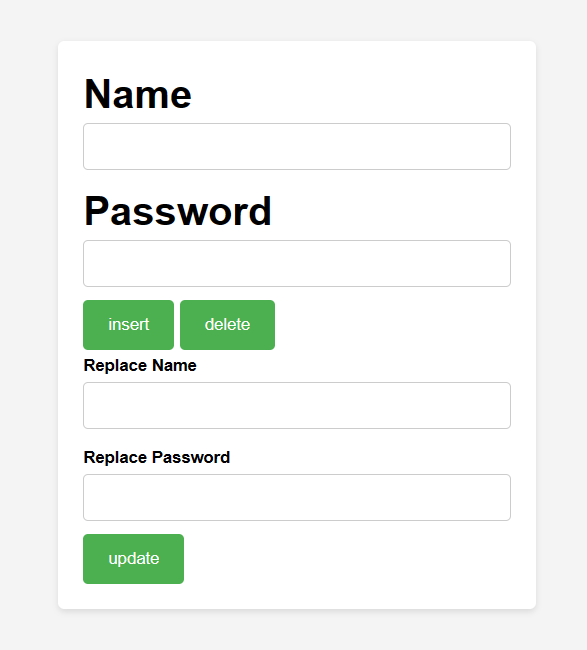

# Social Media Web Application

This is a simple web application built using Java Servlets and JSP (JavaServer Pages) that allows users to perform basic CRUD (Create, Read, Update, Delete) operations on a social media database.

## Features

- Displaying records from the database.
- Adding new records to the database.
- Updating existing records in the database.
- Deleting records from the database.

## Technologies Used

- Java Servlets
- JSP (JavaServer Pages)
- JDBC (Java Database Connectivity)
- MySQL

## Usage

1. Clone this repository.
2. Set up a MySQL database and import the provided schema.
3. Update the database connection details in the servlet (`FormUpdate.java`).
4. Deploy the application on a Servlet container (e.g., Apache Tomcat).
5. Access the application through a web browser.

## Screenshots

